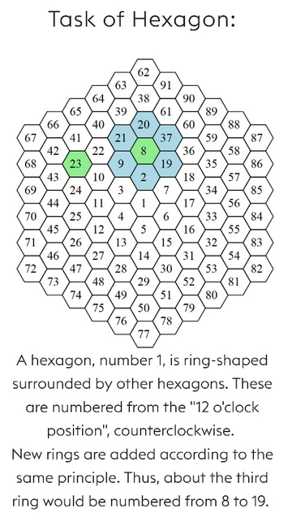
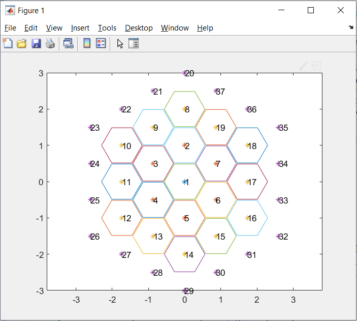
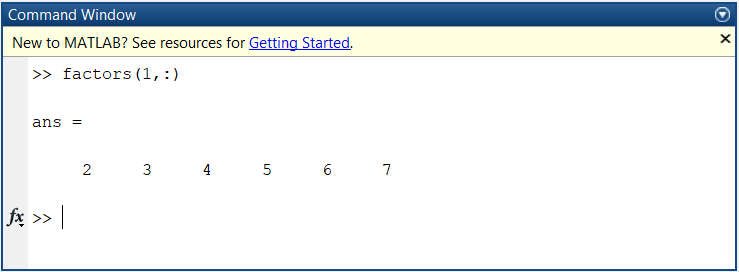
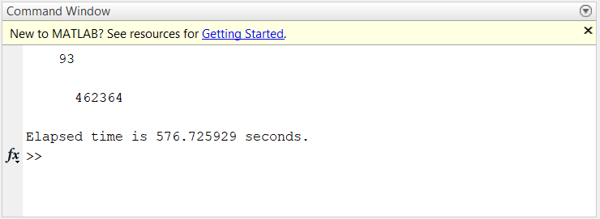

# Objective



To find the 2000th such number in the spiral arrangement of hexagons as seen above, which can divide the product of 6 neighbouring numbers perfectly i.e, the number in the central hexagon should be a factor of the product of the adjacent 6 numbers.

```python
(20 * 37 * 19 * 2 * 9 * 21) / 8 = 664335
(20 * 37 * 19 * 2 * 9 * 21) % 8 = 0
```

# Logic behind the solution

 * As there seems to be no pattern among the numbers distribution around any given hexagon which can be leveraged to find the neighbouring numbers of every hexagon. We resort to reproduce the hexagonal arrangement of numbers as per the problem statement in order to actually determine the neighbouring 6 numbers of any number we are interested in.
 
    

 * The next important step is to identify the 6 neighbouring numbers of all the numbers based on the euclidean distance of nearest 6 numbers
 
    

 * Next, we start to check if the center number is a factor of the product of the 6 neighbouring numbers. Trying to actually multiply and then divide will eventually bring us to the point where a double or float64 can preceisely store the value of multiplication and hence we need to solve this problem in a smart way. My approach to solving this was based on **Prime factorisation**

     * First, we find the prime factors of the center number and the surronding numbers
     * If all the prime factors of the center are present in the prime factors of all the 6 	  	 neighbouring numbers. Then the center number is a factor of the 6 other numbers

 * Finally, stop the program when the 2000th number meeting our criteria is found
 
    
 
