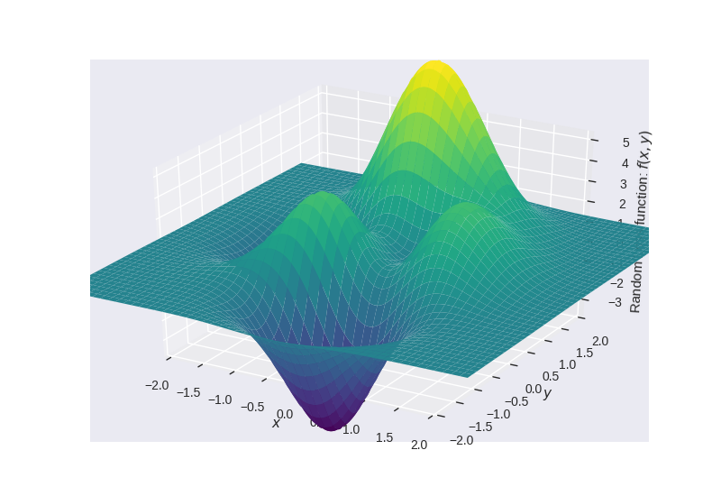
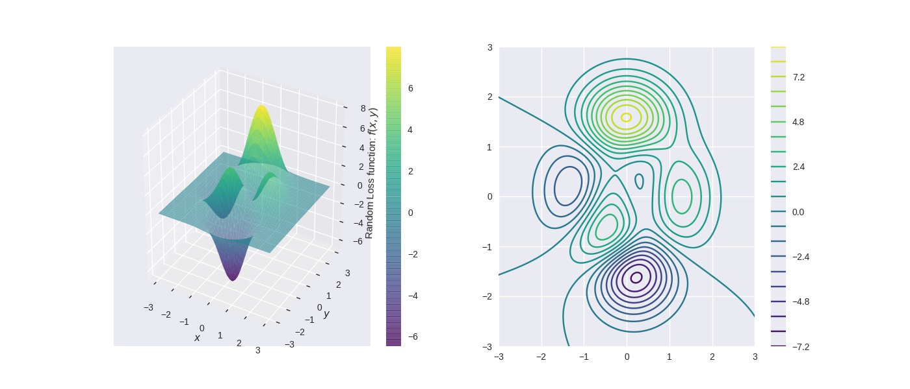

## Optimization algorithms using pytorch

## Optimization algorithms
Optimization algorithms play a central role in the learning process of most of the machine learning and deep learning methods. Here are some of the well known algorithms-
 1. Vanilla Gradient descent
 2. Gradient descent with Momentum
 3. RMSprop
 4. Adam

While all the 4 above listed algorithms differ in their own way and have certain advantages and disadvantages. They share certain similarities with the simple graddient descent algorithm. In this blog post we will go through these 4 algorithms and see how they function on minimizing the loss or finding the minima of a random error function with multiple minimas and maximas.

***

## Error function with multiple minimas and maximas
*Error Function* $= f(x,y) = 3 \times e^{(-(y + 1)^2 - x^2)} \times (x - 1)^2 - \frac{e^{(-(x + 1)^2 - y^2)}}{3} + e^{(-x^2 - y^2)} \times (10x^3 - 2x + 10y^5)$



## Note: In this blog post, I will not be going into the theory of all the algorithms used rather just concentrate on the implementation and the results

For theoretical reference please refer to [d2lai chapter on optimization algorithms](https://d2l.ai/chapter_optimization/index.html)


```python
%matplotlib widget

import torch
import IPython
import numpy as np
import matplotlib as mpl
from IPython import display
from matplotlib import animation
from IPython.display import HTML
import matplotlib.pyplot as plt
from mpl_toolkits.mplot3d import Axes3D
from mpl_toolkits.mplot3d import proj3d
from matplotlib.patches import FancyArrowPatch

# mpl.rcParams['savefig.dpi'] = 300
plt.style.use('seaborn')
```


```python
# To draw 3d arrows in matplotlib
class Arrow3D(FancyArrowPatch):
    def __init__(self, xs, ys, zs, *args, **kwargs):
        FancyArrowPatch.__init__(self, (0, 0), (0, 0), *args, **kwargs)
        self._verts3d = xs, ys, zs

    def draw(self, renderer):
        xs3d, ys3d, zs3d = self._verts3d
        xs, ys, zs = proj3d.proj_transform(xs3d, ys3d, zs3d, renderer.M)
        self.set_positions((xs[0], ys[0]), (xs[1], ys[1]))
        FancyArrowPatch.draw(self, renderer)
```


```python
def calc_z(xx, yy)-> torch.tensor:
    """
    Returns the loss at a certain point
    """
    return 3 * torch.exp(-(yy + 1) ** 2 - xx ** 2) * (xx - 1) ** 2 - torch.exp(-(xx + 1) ** 2 - yy ** 2) / 3 + torch.exp(
        -xx ** 2 - yy ** 2) * (10 * xx ** 3 - 2 * xx + 10 * yy ** 5)
```


```python
fps = 10     # frames per second - to save the progress in optimization as a video
Writer = animation.writers['ffmpeg']
writer = Writer(fps=fps, metadata=dict(artist='Me'), bitrate=1800)
```

## Initialise the plot with the error function terrain


```python
x = torch.linspace(-3, 3, 600)
y = torch.linspace(-3, 3, 600)
xgrid, ygrid = torch.meshgrid(x, y)
zgrid = calc_z(xgrid, ygrid)

fig = plt.figure(figsize=(14,6))
ax0 = fig.add_subplot(121, projection='3d')
ax0.set_xlabel('$x$')
ax0.set_ylabel('$y$')
ax0.set_zlabel('Random Loss function: ' + '$f(x, y)$')
ax0.axis('auto')
cs = ax0.plot_surface(xgrid.numpy(), ygrid.numpy(), zgrid.numpy(), cmap='viridis', alpha=0.6)
fig.colorbar(cs)

ax1 = fig.add_subplot(122)
qcs = ax1.contour(xgrid.numpy(), ygrid.numpy(), zgrid.numpy(), 20, cmap='viridis')
fig.colorbar(qcs)
```



## Vanilla Gradient Descent
Gradient descent algorithm which is an iterative optimization algorithm can be described as loop which is executed repeatedly until certain convergence criteria has been met. Gradient descent can be explained using the following equation.

### Gradient calculation
$\frac{\partial (Error)}{\partial (w_{x,y}^l)} = 
\begin{vmatrix}
\frac{\partial (Error)}{\partial x} \\
\frac{\partial (Error)}{\partial y}
\end{vmatrix}$

### Update equation
$w_{x,y}^l = w_{x,y}^l - lr \times \frac{\partial (Error)}{\partial (w_{x,y}^l)}$


```python
epochs = 20
lr = 0.01                                                # learning rate

xys = torch.tensor([-0.5, -0.7], requires_grad=True)     # initialise starting point of search for minima, another possible starting position np.array([0.1, 1.4])

new_z = 0
dy_dx_current = 0
```


```python
def step_gd(i):
    global dy_dx_current, xys, lr, new_z, ax0, ax1
    if i == 0:
        # initialise starting point of search for minima, another possible starting position np.array([0.1, 1.4])
        xys = torch.tensor([-0.5, -0.7], requires_grad=True) 
        new_z = calc_z(xys[0], xys[1])
        new_z.backward()
        
        dy_dx_current = xys.grad
    
    cache_pt = [xys[0].detach().numpy(), xys[1].detach().numpy(), new_z.detach().numpy()]

    xys = (xys - lr * dy_dx_current).clone().detach().requires_grad_(True)
    
    # vanilla gradient descent
    new_z = calc_z(xys[0], xys[1])
    new_z.backward()
    # store the new gradient with respect to x and y i.e., (d(error))/ (dx), (d(error))/ (dy)
    dy_dx_current = xys.grad
    
    xys_plot = xys.detach().numpy()
    ax0.scatter(xys_plot[0], xys_plot[1], new_z.detach().numpy(), marker='s', c='r', s=20, zorder=3)
    a = Arrow3D([cache_pt[0], xys_plot[0]], [cache_pt[1], xys_plot[1]],
                [cache_pt[2], new_z.detach().numpy()], mutation_scale=5,
                lw=2, arrowstyle="-|>", color="k")
    ax0.add_artist(a)
    
    ax1.scatter(xys_plot[0], xys_plot[1], marker='*', c='r')
```


```python
anim_gd = animation.FuncAnimation(fig, step_gd, frames=epochs, interval=(1/fps)*1000, repeat=False)
```


```python
# HTML(anim_gd.to_html5_video())
anim_gd.save('gd.mp4', writer=writer)
```

<video controls src="../assets/vid/gd.mp4" />

## Gradient descent with momentum

### Gradient calculation

$\frac{\partial (Error)}{\partial (w_{x,y}^l)} = 
\begin{vmatrix}
\frac{\partial (Error)}{\partial x} \\
\frac{\partial (Error)}{\partial y}
\end{vmatrix} = \beta * \begin{vmatrix}
\frac{\partial (Error)}{\partial x} \\
\frac{\partial (Error)}{\partial y}
\end{vmatrix} + (1 - \beta) * \begin{vmatrix}
\frac{\partial (Error_{new})}{\partial x} \\
\frac{\partial (Error_{new})}{\partial y}
\end{vmatrix}$

### Update equation
$w_{x,y}^l = w_{x,y}^l - lr \times \frac{\partial (Error)}{\partial (w_{x,y}^l)}$


```python
epochs = 60
lr = 0.01                                                # learning rate

xys = torch.tensor([-0.5, -0.7], requires_grad=True)     # initialise starting point of search for minima, another possible starting position np.array([0.1, 1.4])

new_z = 0
dy_dx_current_gdm = 0

dy_dx_new_gdm = torch.tensor([0.0, 0.0])
```


```python
def step_gdm(i):
    global dy_dx_new_gdm, dy_dx_current_gdm, xys, lr, new_z, ax0, ax1
    if i == 0:
        # initialise starting point of search for minima, another possible starting position np.array([0.1, 1.4])
        xys = torch.tensor([-0.5, -0.7], requires_grad=True)
        new_z = calc_z(xys[0], xys[1])
        new_z.backward()
        
        dy_dx_current_gdm = xys.grad
    
    cache_pt = [xys[0].detach().numpy(), xys[1].detach().numpy(), new_z.detach().numpy()]
    
    dy_dx_new_gdm = 0.9*dy_dx_new_gdm + (1 - 0.9)*dy_dx_current_gdm
    xys = (xys - lr * dy_dx_new_gdm).clone().detach().requires_grad_(True)
    
    # gradient descent with momentum
    new_z = calc_z(xys[0], xys[1])
    new_z.backward()
    # store the new gradient with respect to x and y i.e., (d(error))/ (dx), (d(error))/ (dy)
    dy_dx_current_gdm = xys.grad
    
    xys_plot = xys.detach().numpy()
    ax0.scatter(xys_plot[0], xys_plot[1], new_z.detach().numpy(), marker='s', c='g', s=20, zorder=3)
    a = Arrow3D([cache_pt[0], xys_plot[0]], [cache_pt[1], xys_plot[1]],
                [cache_pt[2], new_z.detach().numpy()], mutation_scale=5,
                lw=2, arrowstyle="-|>", color="k")
    ax0.add_artist(a)
    
    ax1.scatter(xys_plot[0], xys_plot[1], marker='*', c='g')
```


```python
anim_gdm = animation.FuncAnimation(fig, step_gdm, frames=epochs, interval=(1/fps)*1000, repeat=False)
```


```python
# HTML(anim_gdm.to_html5_video())
anim_gdm.save('momentum.mp4', writer=writer)
```

<video controls src="../assets/vid/momentum.mp4" />

## RMSprop

### Gradient calculation
$\frac{\partial (Error)}{\partial (w_{x,y}^l)} = 
\begin{vmatrix}
\frac{\partial (Error)}{\partial x} \\
\frac{\partial (Error)}{\partial y}
\end{vmatrix} = \beta * \begin{vmatrix}
\frac{\partial (Error)}{\partial x} \\
\frac{\partial (Error)}{\partial y}
\end{vmatrix} + (1 - \beta) * \begin{vmatrix}
\frac{\partial (Error_{new})}{\partial x} \\
\frac{\partial (Error_{new})}{\partial y}
\end{vmatrix}^2$

### Update equation
$w_{x,y}^l = w_{x,y}^l - lr \times \frac{\frac{\partial (Error_{new})}{\partial (w_{x,y}^l)}}{\sqrt{\frac{\partial (Error)}{\partial (w_{x,y}^l)} + \epsilon}}$


```python
epochs = 150
rmsprop_lr = 0.01                                           # learning rate

xys = torch.tensor([-0.5, -0.7], requires_grad=True)        # initialise starting point of search for minima, another possible starting position np.array([0.1, 1.4])

epsilon = 1e-7                                              # small constant to avoid division by zero
new_z = 0
dy_dx_current_rmsprop = 0

dy_dx_new_rmsprop = torch.tensor([0.0, 0.0])
```


```python
def step_rmsprop(i):
    global dy_dx_new_rmsprop, dy_dx_current_rmsprop, xys, rmsprop_lr, new_z, ax0, ax1
    if i == 0:
        # initialise starting point of search for minima, another possible starting position np.array([0.1, 1.4])
        xys = torch.tensor([-0.5, -0.7], requires_grad=True)
        new_z = calc_z(xys[0], xys[1])
        new_z.backward()

        dy_dx_current_rmsprop = xys.grad
    
    cache_pt = [xys[0].detach().numpy(), xys[1].detach().numpy(), new_z.detach().numpy()]
    dy_dx_new_rmsprop = 0.9*dy_dx_new_rmsprop + (1 - 0.9)*torch.pow(dy_dx_current_rmsprop,2)
    xys = (xys - rmsprop_lr * (dy_dx_current_rmsprop/(torch.sqrt(dy_dx_new_rmsprop) + epsilon))).clone().detach().requires_grad_(True)
    
    # gradient descent with momentum
    new_z = calc_z(xys[0], xys[1])
    new_z.backward()
    # store the new gradient with respect to x and y i.e., (d(error))/ (dx), (d(error))/ (dy)
    dy_dx_current_rmsprop = xys.grad
    
    xys_plot = xys.detach().numpy()
    ax0.scatter(xys_plot[0], xys_plot[1], new_z.detach().numpy(), marker='s', c='b', s=20, zorder=3)
    a = Arrow3D([cache_pt[0], xys_plot[0]], [cache_pt[1], xys_plot[1]],
                [cache_pt[2], new_z.detach().numpy()], mutation_scale=5,
                lw=2, arrowstyle="-|>", color="k")
    ax0.add_artist(a)
    
    ax1.scatter(xys_plot[0], xys_plot[1], marker='*', c='b')
```


```python
anim_rmsprop = animation.FuncAnimation(fig, step_rmsprop, frames=epochs, interval=(1/fps)*1000, repeat=False)
```


```python
# HTML(anim_rmsprop.to_html5_video())
anim_rmsprop.save('rmsprop.mp4', writer=writer)
```

<video controls src="../assets/vid/rmsprop.mp4" />

## Adam

### Gradient calculation

${\partial (Error)}_{momentum} = 
\frac{\partial (Error)}{\partial (w_{x,y}^l)} = 
\begin{vmatrix}
\frac{\partial (Error)}{\partial x} \\
\frac{\partial (Error)}{\partial y}
\end{vmatrix} = \beta_1 * \begin{vmatrix}
\frac{\partial (Error)}{\partial x} \\
\frac{\partial (Error)}{\partial y}
\end{vmatrix} + (1 - \beta_1) * \begin{vmatrix}
\frac{\partial (Error_{new})}{\partial x} \\
\frac{\partial (Error_{new})}{\partial y}
\end{vmatrix}$

${\partial (Error)}_{rmsprop} = 
\frac{\partial (Error)}{\partial (w_{x,y}^l)} = 
\begin{vmatrix}
\frac{\partial (Error)}{\partial x} \\
\frac{\partial (Error)}{\partial y}
\end{vmatrix} = \beta_2 * \begin{vmatrix}
\frac{\partial (Error)}{\partial x} \\
\frac{\partial (Error)}{\partial y}
\end{vmatrix} + (1 - \beta_2) * \begin{vmatrix}
\frac{\partial (Error_{new})}{\partial x} \\
\frac{\partial (Error_{new})}{\partial y}
\end{vmatrix}^2$

### Update equation
$w_{x,y}^l = w_{x,y}^l - lr \times \frac{\partial (Error)_{momentum}}{\sqrt{\partial (Error)_{rmsprop} + \epsilon}}$


```python
epochs = 240
adam_lr = 0.01                                           # learning rate

xys = torch.tensor([-0.5, -0.7], requires_grad=True)     # initialise starting point of search for minima, another possible starting position np.array([0.1, 1.4])

epsilon = 1e-7                                           # small constant to avoid division by zero
new_z = 0
dy_dx_current_mom = 0
dy_dx_current_rmsprop = 0

dy_dx_new = torch.tensor([0.0, 0.0])
```


```python
def step_adam(i):
    global dy_dx_current_mom, dy_dx_current_rmsprop, dy_dx_new, xys, adam_lr, new_z, ax0, ax1
    if i == 0:
        # initialise starting point of search for minima, another possible starting position np.array([0.1, 1.4])
        xys = torch.tensor([-0.5, -0.7], requires_grad=True)
        new_z = calc_z(xys[0], xys[1])
        new_z.backward()

        dy_dx_new = xys.grad
    
    cache_pt = [xys[0].detach().numpy(), xys[1].detach().numpy(), new_z.detach().numpy()]
    
    dy_dx_current_mom = 0.9*dy_dx_current_mom + (1 - 0.9)*dy_dx_new
    dy_dx_current_rmsprop = 0.9*dy_dx_current_rmsprop + (1 - 0.9)*torch.pow(dy_dx_new,2)
    xys = (xys - adam_lr * (dy_dx_current_mom/(torch.sqrt(dy_dx_current_rmsprop) + epsilon))).clone().detach().requires_grad_(True)
    
    # gradient descent with momentum
    new_z = calc_z(xys[0], xys[1])
    new_z.backward()
    # store the new gradient with respect to x and y i.e., (d(error))/ (dx), (d(error))/ (dy)
    dy_dx_new = xys.grad
    
    xys_plot = xys.detach().numpy()
    ax0.scatter(xys_plot[0], xys_plot[1], new_z.detach().numpy(), marker='s', c='c', s=20, zorder=3)
    a = Arrow3D([cache_pt[0], xys_plot[0]], [cache_pt[1], xys_plot[1]],
                [cache_pt[2], new_z.detach().numpy()], mutation_scale=5,
                lw=2, arrowstyle="-|>", color="k")
    ax0.add_artist(a)
    
    ax1.scatter(xys_plot[0], xys_plot[1], marker='*', c='c')
```


```python
anim_adam = animation.FuncAnimation(fig, step_adam, frames=epochs, interval=(1/fps)*1000, repeat=False)
```


```python
# HTML(anim_adam.to_html5_video())
anim_adam.save('adam.mp4', writer=writer)
```

<video controls src="../assets/vid/adam.mp4" />

## Results

We see that all the algorithms find the minimas but take significatnly different paths. While Vanilla gradient descent and gradient descent with momentum find the minima faster compared to RMSprop and Adam here for the same learning rate, studies have proven Adam to be more stable and this ability allows to use higher learning rates as compared to the same learning rates used here.
